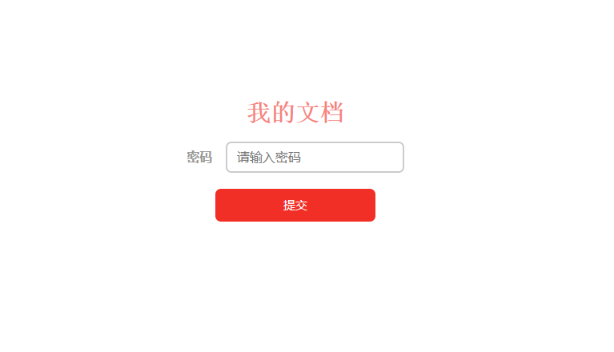
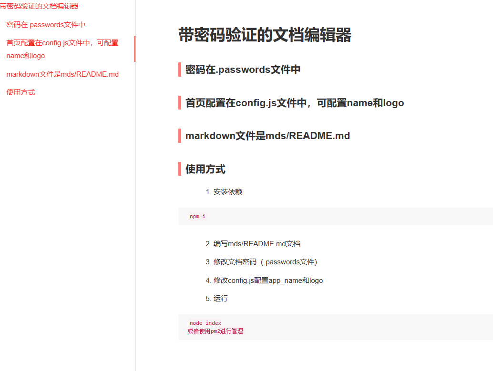

# 带密码验证的文档编辑器

## 密码在.passwords文件中

## 首页配置在config.js文件中，可配置name和logo

## markdown文件是mds/README.md


## 使用方式

1. 安装依赖
```
npm i
```

2. 编写mds/README.md文档

3. 修改文档密码（.passwords文件）

4. 修改config.js配置app_name和logo

5. 运行
```
node index
或者使用pm2进行管理
```




